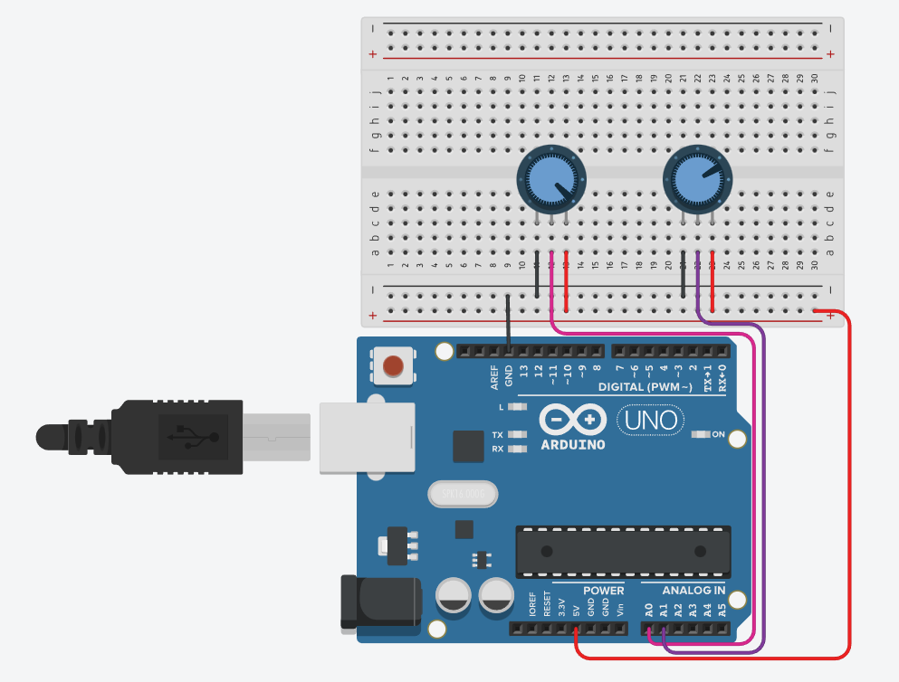
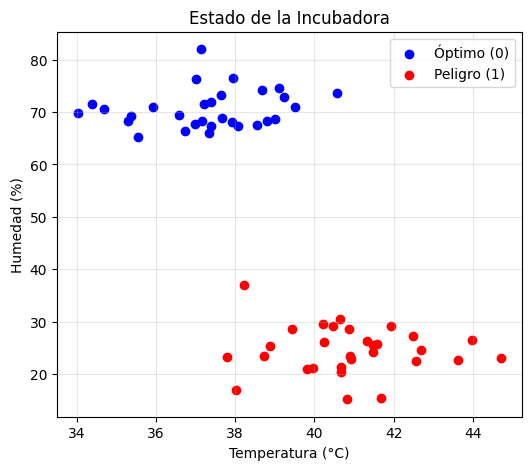
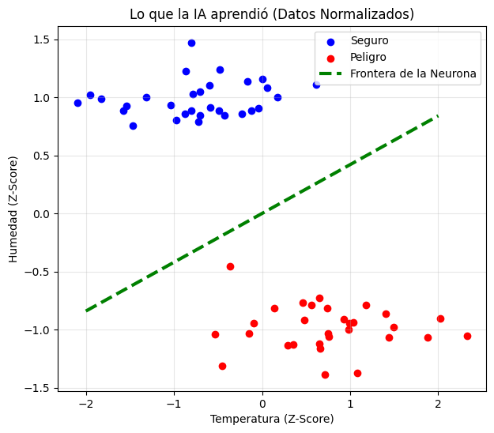

# 🧬 Incubadora Inteligente con Control Neuronal

## 📖 Descripción Técnica y Flujo de Datos
Este proyecto implementa un **Perceptrón (Neurona Artificial)** entrenado en Python y desplegado en un microcontrolador (Arduino) para controlar una incubadora.

**Puntos clave de la implementación:**
* **Entrenamiento (Python):** Se obtuvieron los pesos sinápticos ($w_1=0.0343, w_2=-0.0816$) y el sesgo ($b=0.0$) optimizando la detección de ambientes "Calientes y Secos".
* **Adaptación de Hardware (`map`):** En Arduino, las señales analógicas (0-1023) se transforman a magnitudes físicas (25-45°C y 20-90%) usando la función `map()`.
* **Preprocesamiento Embebido (`StandardScaler`):** Se replicó manualmente la normalización Z-score en C++ ($z = \frac{x - \mu}{\sigma}$), utilizando las medias y desviaciones estándar calculadas previamente en el entrenamiento.

---

## ⚡ Simulación de Hardware (Tinkercad)
Aquí se muestra el diseño del circuito físico utilizado para validar los datos.

> **Nota de Implementación:** Debido a que Tinkercad no cuenta con el sensor **DHT22** nativo, se utilizan **potenciómetros** para simular las entradas de Temperatura y Humedad. Esto permite manipular manualmente los valores para testear la respuesta de la neurona ante cualquier escenario.

  
    
  <a href="https://www.tinkercad.com/things/ddX1ErLD8sU-terrific-leelo-fulffy"><strong>🔌 Interactuar con la simulación en Tinkercad</strong></a>

---

## 📈 Análisis de Datos y Aprendizaje
El modelo normaliza las entradas de Temperatura y Humedad para encontrar una **frontera de decisión** óptima.

  
  &nbsp; &nbsp;
  

* **Izquierda:** Distribución inicial de los datos (Peligro en Rojo, Seguro en Verde).
* **Derecha:** La línea roja representa lo que aprendió la neurona. Todo lo que cae arriba de la línea activa la alarma.

---

## 📊 Resultados de Pruebas (Matriz de Predicción)
Se evaluó el modelo con 3 escenarios críticos para verificar la lógica de la neurona.

| Escenario | Temperatura | Humedad | Predicción (Sigmoide) | Decisión | Estado |
| :--- | :---: | :---: | :---: | :---: | :--- |
| **1. Ambiente Seguro** | 34°C | 50% | 0.024 | `0` | ✅ Seguro |
| **2. Peligro Crítico** | 42°C | 25% | 0.981 | `1` | 🚨 ALARMA |
| **3. Efecto Sauna** | 40°C | 90% | 0.113 | `0` | ✅ Seguro |

> **Nota sobre el "Efecto Sauna":** Observa el caso 3. Aunque la temperatura es alta (40°C), la humedad extrema (90%) inhibe la activación de la neurona, demostrando que el sistema aprendió a compensar variables.

---

## 🤖 Implementación en Microcontrolador
El archivo `src/incubadora_arduino.ino` contiene la implementación de la neurona en C++ para Arduino.

**Flujo de despliegue:**
1.  Se entrenó el modelo en Python (Google Colab).
2.  Se obtuvieron los pesos sinápticos (`w1`, `w2`) y el sesgo (`b`).
3.  Se obtuvieron la media y desviación estándar para la normalización (`StandardScaler`).
4.  **Estos valores se "quemaron" (hardcoded) en el Arduino** para que pueda tomar decisiones autónomas sin necesitar una computadora conectada.

---

## 🛠️ Instalación y Uso
1. Clonar el repositorio.
2. Instalar dependencias: `pip install -r requirements.txt`
3. Ejecutar el notebook en `src/incubadora_neuronal.ipynb`.

---
*Desarrollado para el curso de Fundamentos de IA y Bio-Ingeniería.*
